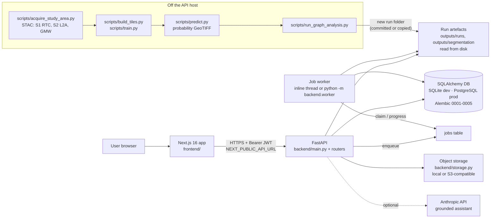

# Architecture

_Last verified against the code: 2026-10-01. Replaces the 2026-09-18 version (which described a file-only,
database-free backend)._

EcoConnectAI is three pieces: a science library (`ecoconnect/`) that turns satellite imagery into habitat
patches and a connectivity graph, a FastAPI service (`backend/`) that serves stored analysis runs and holds
application state, and a Next.js 16 web app (`frontend/`). Model training and inference run off the API
host. The API only serves and recomputes graph-level results from stored runs.

Status: research prototype. Metrics measure agreement with Global Mangrove Watch (GMW) weak labels.
Scenarios are simulations. Nothing has been validated in the field.

## 1. Components

| Component | Where | Notes |
|---|---|---|
| Web app | `frontend/` (Next.js 16.3, React 19, Leaflet, React Flow, Recharts) | Calls the API directly at `NEXT_PUBLIC_API_URL` (`frontend/lib/api.ts`). `next.config.ts` also rewrites `/api/*` to the backend. |
| API | `backend/main.py` plus routers `routers.py`, `jobs_api.py`, `registry_api.py`, `workflow_api.py`, `admin_api.py` | Sync FastAPI handlers. The app-wide dependency `security.validate_path_params` rejects non-slug path ids. |
| Database | `backend/db.py`, 20 tables; migrations `backend/migrations/versions/0001`–`0005` | SQLite by default (`outputs/ecoconnect.db`). Set `ECO_DATABASE_URL` for PostgreSQL. Migrations run at startup (`backend/migrate.py`), and pre-Alembic databases are stamped `0001`. Geometry is stored as GeoJSON text plus bbox columns, with no PostGIS types. |
| Run artefacts | `outputs/runs/<area>/<run_id>/`, `outputs/segmentation/<exp>/` | Immutable folders written by the pipeline and read by the API. They are baked into the Docker image (`COPY outputs/`). Rasters and `.pth` files are git- and docker-ignored. |
| Object storage | `backend/storage.py` | `ECO_STORAGE=local` (default) stores under `OUTPUTS_DIR`. `ECO_STORAGE=s3` works with any S3-compatible bucket (`ECO_S3_BUCKET`, `ECO_S3_ENDPOINT_URL`, `ECO_S3_PREFIX`). Today it holds field-evidence photos (`evidence/<file>`). The DB stores only keys and hashes. |
| Job queue and worker | `backend/jobs.py`, `backend/job_handlers.py`, `backend/worker.py` | The queue is the `jobs` table, with no Redis. The inline worker thread starts with the API (`ECO_INLINE_WORKER=1`, the default). A separate worker is `python -m backend.worker`. |
| Assistant | `backend/assistant_llm.py`, `backend/insight.py` | Signed-in users get Claude answers when `ANTHROPIC_API_KEY` is set, capped per user per hour. Everyone else gets the template answer (`insight.answer`). |
| Observability | `backend/observability.py`, `backend/admin_api.py` | `X-Request-ID`, JSON logs and in-memory per-route metrics. The metrics reset on restart. |

## 2. Module map

### `backend/`

| Module | Responsibility |
|---|---|
| `main.py` | App, lifespan (migrate → `registry.sync_all` → seed demo users → `alerts.ensure_alerts` → start inline worker), CORS, run-artefact endpoints, what-if, restoration, reanalyse, scenario, timeline, quicklook and probability PNGs, `POST /api/segment` |
| `routers.py` | Auth (login/refresh/logout/me), users, registry, model cards, alerts, detections, field tasks, evidence upload/verify/photo, projects, saved scenarios, audit, evidence chain, assistant, reports and PDF |
| `workflow_api.py` | Restoration review stage machine (GIS_REVIEW → FIELD_VERIFICATION → FEASIBILITY → DECIDED), field checklist, HITL disagreement register and GeoJSON export |
| `registry_api.py` | Model status ladder (DEVELOPMENT → EXPERIMENTAL → CANDIDATE → VALIDATED), experiment comparison, provenance lineage, `POST …/reproduce` |
| `jobs_api.py` | `/api/jobs` (submit/list/get/cancel), `/api/artifacts` |
| `admin_api.py` | `/api/admin/system` (health, schema, jobs, metrics, store sizes) |
| `auth.py` | bcrypt hashing, JWT access tokens, rotating refresh tokens, capability matrix, `require()`, demo-user seeding |
| `security.py` | Slug validation, `contained()` path guard, login throttle, `cors_config()` |
| `paths.py` | `RUNS_DIR`/`SEG_DIR`, `resolve_run` (the only run resolver, including `latest`), `run_summary` |
| `db.py` | ORM models, `audit()` helper, enums (roles, statuses, checklist) |
| `migrate.py`, `migrations/` | Alembic (0001 baseline, 0002 jobs + artifacts, 0003 model registry, 0004 phase-5 workflow, 0005 refresh tokens) |
| `jobs.py`, `job_handlers.py`, `worker.py` | Queue, handlers (`segment`, `scenario`, `reproduce`), standalone worker |
| `storage.py`, `artifacts.py` | Storage backends, sha256 artifact registry |
| `registry.py` | Mirrors on-disk study areas, scenes/labels, models, runs and artifacts into the DB at startup and on `POST /api/registry/sync` |
| `provenance.py` | Ordered lineage (study area → satellite data → labels → preprocessing → model → threshold → probability raster → patch extraction → graph → metric → [result] → run) |
| `scenarios.py` | Scenario Lab computations and Restoration Planner feasibility |
| `alerts.py` | Rule engine over run artefacts (`RULES_VERSION` stamped into each alert) |
| `insight.py` | Evidence chain, template assistant, official report content |
| `assistant_llm.py` | Evidence pack → Claude, citations filtered to the pack, proposed scenarios validated against real ids |
| `report_pdf.py` | fpdf2 rendering of official reports |
| `restoration_rules.py` | Re-export of `ecoconnect/pipeline/restoration_rules.py` (the "uncertain habitat" rule) |
| `observability.py` | Request-ID middleware, JSON logging, metrics |

### `ecoconnect/`

| Package | Contents |
|---|---|
| `gee/` | `stac_acquire.py` (credential-free STAC: Sentinel-1 RTC, Sentinel-2 L2A), `gmw_labels.py` (GMW v3 weak labels), `gee_acquire.py` (optional Earth Engine path) |
| `geospatial/` | `raster_processing/io.py`, `preprocessing/` (tiling, transforms), `patch_extraction/extract.py` (threshold → connected components → patches) |
| `ml/` | `datasets/tiles.py`, `models/unet.py` (U-Net with an EfficientNet encoder via segmentation-models-pytorch), `training/trainer.py`, `evaluation/`, `inference/predict.py`. Needs PyTorch, which is **not** in the API image. |
| `graph/` | `construction` (k-NN ≤ τ), `connectivity` (IIC/PC/ECA), `criticality` (exact leave-one-out), `what_if`, `restoration`, `explain`, `sensitivity` (τ×k grid), `temporal` (patch tracking between runs by polygon overlap), `types` |
| `pipeline/` | `config` (YAML + `ECO_<SECTION>__<KEY>` overrides, `.env` loader), `sources`, `analysis` (writes a run folder), `report`, `frontend_adapter`, `provenance` (git commit, config/file hashes), `restoration_rules` |

## 3. Data flow of one analysis run

1. **Acquire** (`scripts/acquire_study_area.py`) writes `${DATA_ROOT}/scenes/<area>/<scene>.tif` plus a `.json`
   sidecar, and GMW labels to `${DATA_ROOT}/labels/<area>/`.
2. **Tile, train, evaluate** (`build_tiles.py`, `train.py`, `evaluate.py`, `threshold_sweep.py`) write
   `outputs/segmentation/<exp>/` (`best_model.pth`, `metrics.json`, `experiment.json`,
   `threshold_calibration.json`, plots).
3. **Predict** (`scripts/predict.py`) writes a probability GeoTIFF (`…/predictions/<area>_prob.tif`, plus
   confidence and binary rasters).
4. **Graph analysis** (`scripts/run_graph_analysis.py` → `ecoconnect/pipeline/analysis.py`): threshold → patches
   (MMU) → graph → IIC/PC/ECA → leave-one-out criticality → what-if of the top patch → explanations → restoration
   candidates → τ sensitivity. It writes `outputs/runs/<area>/<run_id>/`: `manifest.json`, `patches.geojson`,
   `graph.json`, `metrics.json`, `criticality.{json,csv}`, `explanations.json`, `restoration.{json,csv}`,
   `what_if_top1.json`, `tau_sensitivity.json`, `patches_input.json`, `frontend_bundle.json`.
   `outputs/runs/<area>/LATEST` names the run the UI shows by default. This is chosen, not simply the newest run.
5. **Registration**: at API startup (or `POST /api/registry/sync`) `registry.sync_all` creates
   `analysis_versions`, `models` and `artifacts` rows (with sha256) and `alerts.ensure_alerts` refreshes OPEN
   alerts for the LATEST runs.
6. **Serving**: the UI loads `GET /api/runs/<area>/latest/bundle` and the other artefact endpoints. Interactive
   endpoints rebuild the graph from `patches_input.json` and the manifest config on each request.

From the UI, steps 3–5 can run as a `segment` job (`POST /api/segment`, capability `run_analysis`). The
job shells out to `scripts/predict.py` (when a scene and checkpoint are given) and `scripts/run_graph_analysis.py`,
then syncs the registry. This needs scenes, a checkpoint and PyTorch on the worker host. The deployed API
image has none of these, so on the live deployment new runs are produced off-host and shipped as run folders.

## 4. Provenance

| What | Where | Caveat |
|---|---|---|
| Git commit and dirty flag | `manifest.code` (`ecoconnect/pipeline/provenance.code_version`) | `None` outside a git checkout (the Docker image excludes `.git`) |
| Config hash | `manifest.config_sha256` (canonical JSON of the run config) | |
| Input hashes | `manifest.input_sha256` (probability raster, model checkpoint) | `None` when the file is not on the producing machine |
| Artefact hashes | `artifacts` table: key, sha256, size, kind, run/model id, `processing_version` | Re-hashed on sync only when the file size changes |
| Lineage | `GET /api/provenance/{area}/{run}` (also embedded in the evidence chain) | Built from manifest + registry at request time |
| Audit | `audit_log` table (see `docs/SECURITY.md`) | |

**Honest status:** the manifests of the 11 runs currently stored under `outputs/runs/` predate these fields.
None of them contains `code`, `config_sha256` or `input_sha256` (checked 2026-10-01). Only runs produced by the
current pipeline code carry them. `experiment.json` of the stored segmentation experiments has no commit or
config hash either.

## 5. Job lifecycle

States: `QUEUED → RUNNING → COMPLETED | FAILED | CANCELLED` (`backend/jobs.py`).

- **Enqueue**: `jobs.enqueue` inserts a row and audits `enqueue_job`. Job types and who may submit them:
  `segment` (only via `POST /api/segment`, `run_analysis`, at most one queued or running at a time), `scenario`
  (any signed-in user via `POST /api/jobs`), `reproduce` (any signed-in user via `POST …/reproduce`, max 3 queued
  per user).
- **Claim**: a conditional `UPDATE … WHERE status='QUEUED'`. This is atomic on SQLite and PostgreSQL, so several
  workers can share one DB.
- **Progress**: handlers call `ctx.progress(fraction, stage, log)`, which commits `progress`, `stage`,
  `heartbeat_at` and a log tail (20 000 chars).
- **Cancel**: `POST /api/jobs/{id}/cancel` sets `CANCELLED`. A running handler stops at its next `progress()` call.
  A subprocess already running (predict / graph analysis) is not killed.
- **Failure**: exceptions set `FAILED` with the traceback tail in `log`. Subprocess steps time out after
  `ECO_JOB_TIMEOUT_S` (7200 s). On worker start, `fail_stale()` marks RUNNING jobs with no heartbeat for
  `ECO_JOB_STALE_MIN` (30) minutes as FAILED. There are no automatic retries.
- **Progress delivery is polling only.** The frontend calls `GET /api/jobs/{id}` every 2 s (`waitForJob` in
  `frontend/lib/api.ts`). There is no Server-Sent Events or WebSocket endpoint in the backend or frontend.

## 6. Caching: precomputed vs recomputed

| Precomputed once per run (files in the run folder) | Recomputed on every request (no in-memory cache) |
|---|---|
| Patches, graph, IIC/PC/ECA, criticality ranking, explanations, restoration ranking, top-1 what-if, τ sensitivity, frontend bundle | Graph rebuild from `patches_input.json` for what-if, restoration with user costs, reanalyse (τ/k/metric), Scenario Lab, restoration feasibility, `reproduce` |
| Model metrics, calibration, plots (`outputs/segmentation/<exp>/`) | "Uncertain habitat" annotation of restoration candidates (applied when `bundle` / `restoration` are served) |
| | Report (`GET …/report`), provenance lineage, evidence chain, timeline mask difference (reads two probability TIFFs when present) |

The graphs are tens of patches (12 for Kerala LATEST, 54 for Sundarbans), so recomputation is milliseconds.
One disk cache exists: `probability.png` and scene `quicklook.png` are rendered from GeoTIFFs and cached in
`outputs/quicklooks/`. These endpoints need the TIFFs, which are not in the repo or the image. Model assets are
served with `Cache-Control: public, max-age=3600`, and evidence photos with `private, max-age=3600`.

## 7. Deployment: provider-neutral design, one concrete instance

The code depends on generic interfaces only: a SQLAlchemy URL, an S3-compatible API, environment variables and
a Docker image. Swapping providers means changing configuration, not code. `docker-compose.yml` runs backend +
frontend locally, with optional `worker` and `postgres` profiles.

The one deployment in use (free tiers, see `docs/DEPLOYMENT.md`; recorded 2026-09-30/10-01 in
`docs/context/PROJECT_CONTEXT.md` §10):

| Layer | Service |
|---|---|
| Frontend | Vercel, root `frontend/`, `NEXT_PUBLIC_API_URL` → the Render API |
| API | Render free web service, Docker (`Dockerfile`, `render.yaml`), health check `/api/ready`, inline worker (no separate worker service). Sleeps when idle. |
| Database | Neon PostgreSQL (`ECO_DATABASE_URL`) |
| Object storage | S3/R2 is supported and documented. Enabling R2 on the live service is listed as an optional user step. Without it, `ECO_STORAGE=local` writes photos to the container disk, which does not survive a redeploy. |
| Training / inference | Off-host (local Apple M3 for the dev B0 models; UNB7 intended for Colab/Kaggle GPU, not trained) |
| CI | `.github/workflows/ci.yml` (see `docs/SECURITY.md`). The GitHub account is currently billing-locked, so Actions do not run. |
