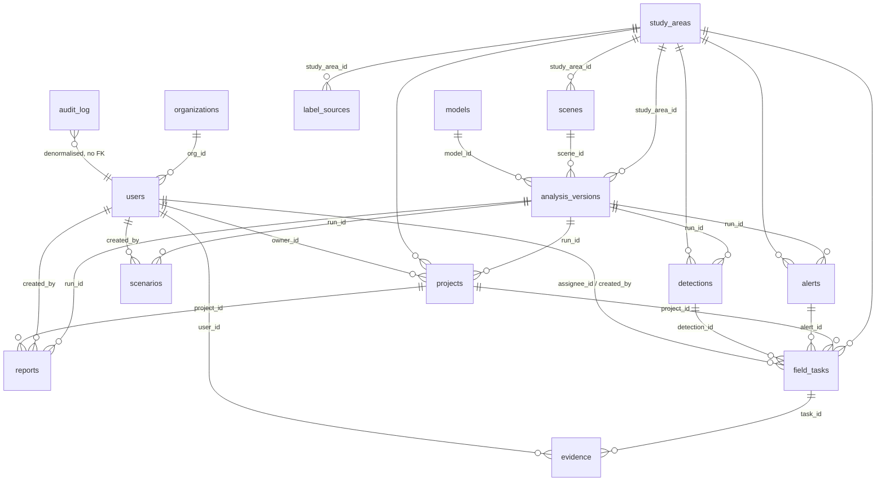

# EcoConnectAI — Architecture & Codebase Audit (2026-09-27)

Read-only audit of commit `5ea6ff9` (main). Method: every backend, science-package and frontend file was
read; test suite executed on a fresh clone (43 passed, 1 skipped — ML smoke test needs torch); one
security finding reproduced against a throw-away directory. Nothing was changed in the code.

Section letters follow the user's spec (§2 A–P, §50 items 1–10).

---

## 0. The user's target spec (summary, so the chat need not be kept)

Evolve EcoConnectAI into a cloud-native coastal-ecosystem intelligence & decision-support platform
without destroying the working system and without fabricating anything. Requested capabilities:
object-storage abstraction (local/S3) with artifact metadata; PostgreSQL+PostGIS (SQLite kept for dev)
with entities users/roles/study_areas/analysis_runs/datasets/scenes/models/model_versions/jobs/patches/
graph_nodes/edges/metrics/criticality/scenarios/restoration/field_tasks/observations/reports/artifacts/
audit/explanations/provenance/experiments; full **provenance chain** ("Why am I seeing this?");
**model registry** (Development/Experimental/Candidate/Validated) and **experiment tracking**; multi-sensor
design (S1, S2, fusion — never claim untrained); **temporal** analysis ("modelled habitat change");
**network digital twin**; extended **criticality** + transparent multi-criteria scoring; **sensitivity**
(τ 3/5/8 km, rank correlation); serious **Scenario Lab** (remove/reduce/restore/add/radius, before/after);
**restoration intelligence** with "Not assessed" fields and model-vs-human decision workflow; **field
verification** + HITL disagreement dataset (no auto-retrain); **uncertainty** (uncalibrated → say so);
explainability; **grounded GenAI assistant** (retrieve → evidence → LLM → cite; NL → structured scenario
command → validation → engine, confirm before running); PDF reports with "Not field validated"; real
backend-enforced **RBAC** (6 roles); **audit** of every action; security (JWT, refresh, hashing, rate
limit, CORS, secrets, upload/path validation); clean REST + OpenAPI; **async jobs** (QUEUED→RUNNING→
COMPLETED/FAILED with progress/logs); observability (/health, /ready, request/job IDs, structured logs);
**CI/CD** (GitHub Actions: lint→types→tests→build→security→docker→deploy); **Docker** (frontend, backend,
worker, db; one-command compose); vendor-neutral cloud; **cost control**; GIS map; before/after views;
research dashboard; reproducibility ("Reproduce this analysis"); Research & IP notes (no patent/novelty
claims); professional README + ARCHITECTURE/DATA/MODEL_CARD/LIMITATIONS/SECURITY/CONTRIBUTING/API/
DEPLOYMENT/RESEARCH; demo mode around real P17 story; scientific (not "AI-buzzword") design; tests incl.
"removing P17 reproduces stored result" and determinism; visible limitations; P0–P3 prioritisation;
8 phases (see `ROADMAP.md`).

---

## A. Current architecture

```mermaid
flowchart TB
  subgraph Offline["Offline science pipeline (laptop / Colab) — scripts/*.py, synchronous"]
    STAC["STAC: S1 RTC (Planetary Computer)\nS2 L2A (Earth Search)\nGMW v3 2020 (Zenodo)"] --> ACQ[ecoconnect/gee/stac_acquire + gmw_labels]
    ACQ --> SCN[(data/scenes/*.tif\ndata/labels/*.tif\ngitignored)]
    SCN --> TILE[geospatial/preprocessing/tiling\n256px, stride128, spatial blocks]
    TILE --> TRAIN[ml/training/trainer\nU-Net EffNet-B0, BCE+Dice]
    TRAIN --> CKPT[(outputs/segmentation/exp/\nbest_model.pth gitignored\nmetrics.json tracked)]
    CKPT --> PRED[ml/inference/predict\nsliding window + Hann]
    PRED --> PROB[(probability.tif gitignored)]
    PROB --> PATCH[patch_extraction/extract\nthreshold, 8-conn, MMU 2 ha]
    PATCH --> GRAPH[graph/*: kNN≤τ, IIC/PC/ECA,\nleave-one-out, what-if, restoration, explain]
    GRAPH --> RUN[(outputs/runs/area/run_id/*.json\n+ LATEST — tracked in git)]
  end
  subgraph API["FastAPI backend (single process, sync)"]
    MAIN[main.py: runs, artefacts,\nwhat-if, reanalyse, segment, PNG renders]
    ROUT[routers.py: auth, alerts, detections,\nfield, evidence, projects, scenarios,\naudit, assistant, reports]
    DB[(SQLite outputs/ecoconnect.db\n15 tables, create_all)]
    REG[registry.py: sync runs → DB at startup]
  end
  RUN --> MAIN
  RUN --> REG --> DB
  ROUT --> DB
  MAIN -. subprocess .-> PRED
  MAIN -. subprocess .-> GRAPH
  FE["Next.js 16 frontend (Vercel)\nLeaflet · React Flow · Recharts"] -->|REST + Bearer JWT (localStorage)| MAIN
  FE --> ROUT
```

Deployed today: backend Docker (API-only deps, no torch) on Render free tier with precomputed
`outputs/` baked into the image; frontend on Vercel. SQLite is ephemeral there.

## B. Current data flow

1. `scripts/acquire_study_area.py` → STAC search → median composites on a snapped UTM 10 m grid →
   `data/scenes/<area>_<year>_s12_10m.tif` (bands: S1 VV, VH dB; S2 B2,B3,B4,B8,B11,B12; NDVI; NDWI) +
   GMW label raster (255 = outside coverage).
2. `build_tiles.py` → 256² tiles, stride 128, skip rules, 4×4-tile spatial blocks → 70/15/15 split, seed 42.
3. `train.py` → z-score normaliser (1/99 clip, cached `stats_bands-*.json`) → U-Net → `best_model.pth`,
   `metrics.json`, `history.csv`, plots; row appended to `experiments.csv`.
4. `evaluate.py` / `threshold_sweep.py` → test metrics, calibrated threshold.
5. `predict.py` → probability / confidence / binary rasters.
6. `run_graph_analysis.py` → patches → graph → metrics → criticality → what-if top1 → τ sensitivity →
   restoration → explanations → `frontend_bundle.json` + `manifest.json`; `LATEST` updated.
7. Backend startup: `registry.sync` loads manifests into `analysis_versions`, scenes, models; alerts
   engine derives alerts; UI loads `/api/runs/<area>/latest/bundle`; interactive endpoints recompute
   the graph in memory (milliseconds–seconds).

## C. Current database ER diagram (`backend/db.py`)



Notes: FKs only, no `relationship()`; no unique constraint on detections `(run_id, object_type,
object_id)` despite upsert; `field_tasks.run_id` has no FK; no migrations (`create_all` only); JSON
columns for metrics/manifest/params; no spatial types (lat/lon floats, geometry lives in GeoJSON files).
Patches, graph nodes/edges, criticality are **files**, not rows.

## D. Current ML pipeline

| Stage | Implementation | Key params |
|---|---|---|
| Acquisition | `ecoconnect/gee/stac_acquire.py` (STAC, no creds); `gee_acquire.py` optional (uses S1 **GRD**, inconsistent) | S2 SCL mask, ≥98 % AOI coverage, BOA offset; S1 RTC γ⁰ dB temporal median |
| Labels | `gmw_labels.py` | GMW v3 2020, nearest resampling, 255 ignore |
| Tiling | `geospatial/preprocessing/tiling.py` | 256, stride 128, min_valid 0.6, min_labelled 0.5, 4×4 blocks 0.7/0.15/0.15 seed 42 |
| Normalisation | `transforms.py` | z-score, 1/99 clip, ≤400 train tiles, cache keyed only by band subset (**stale-cache bug**) |
| Model | `ml/models/unet.py` (smp Unet) | EffNet-B0 dev / B7 full (untrained), ImageNet weights, 1-class sigmoid |
| Training | `ml/training/trainer.py`, `configs/train_dev.yaml` | AdamW 3e-4, wd 1e-4, cosine, 40 ep, patience 12 (val IoU), BCE(pos_w 25)+Dice, batch 8, seed 42 |
| Eval | `ml/evaluation/metrics.py`, `scripts/evaluate.py` | dataset-level CM → IoU/Dice/P/R/F1/OA/κ |
| Threshold | `scripts/threshold_sweep.py` | 0.30–0.70, best F1 **on test split** |
| Inference | `ml/inference/predict.py` | 256 window, overlap 64, Hann blend, optional flip TTA; writes prob, confidence=|p−.5|·2, binary |

Results: see `PROJECT_CONTEXT.md §3`.

## E. Current graph pipeline

- Patches (`extract.py`): `prob ≥ t` on valid pixels → `ndimage.label` 8-conn → MMU 2 ha → true pixel
  area → centroid (WGS84) → polygon (simplified 10 m) → confidence Cᵢ = mean prob (= quality qᵢ).
  IDs P01… assigned by descending area **per run**.
- Candidates (`pipeline/sources.py:56-66`): components with 0.30 ≤ p < t, ≥ 1 ha, max 12.
- Construction (`graph/construction.py`): k = 3 nearest by haversine centroid distance, keep d ≤ τ = 5 km,
  union-symmetrised; wᵢⱼ = √(qᵢqⱼ)·e^(−d/τ).
- Metrics (`connectivity.py`): IIC (topological BFS, unweighted), PC (p = e^(−αd), p(τ)=0.5, max-product
  Floyd–Warshall on complete matrix, O(n³) pure Python), ECA = √PC·A_L, interface score Eq. 7 (UI only).
- Criticality (`criticality.py`): exact leave-one-out ΔC, S = ΔC/C, cut vertex = component count rises,
  Spearman(area, S), τ sensitivity {3,5,8} with rank ρ + top-5.
- What-if (`what_if.py`): remove set → rebuild → recompute; severed edges, isolated, affected.
- Restoration (`restoration.py`): R = C(G+v) − C(G), gain-ranked; cost-aware only if every candidate has a
  user cost.
- Explanations (`explain.py`): rule text from computed values (S ≥ .25/.10/.03 levels).

## F. Frontend module map

| Route | Purpose | Data | Status |
|---|---|---|---|
| `/` | Landing (11 sections) | static snapshot + `/api/study-areas` | PARTIAL — hard-coded Kerala numbers without disclaimer |
| `/login` | demo personas | `/api/auth/*` | REAL (shows demo password) |
| `/command` | main dashboard: map, KPIs, what-if, change chart | bundle, alerts, tasks, quicklook | REAL (one false "prototype geometry" sentence `:317`) |
| `/analysis` | map, probability overlay, sensitivity explorer, evidence drawer | probability.png, reanalyse, evidence | REAL |
| `/graph` | React Flow network | bundle | REAL ("critical bridges" = S ≥ 0.25, not cut vertices) |
| `/scenario` | Scenario Lab A–G | `POST /scenario`, `/api/scenarios` | REAL, labelled SIMULATED |
| `/simulation` | legacy what-if/restore/timeline tabs | `POST /restoration` | PARTIAL — hard-coded ₹ budget UI, causal timeline badges; duplicates `/scenario` + `/restoration` |
| `/restoration` | feasibility + cost ranking | feasibility, restoration, field-tasks | REAL |
| `/field` | tasks, evidence, detections | field APIs | REAL (evidence photos 401 — `` can't send Bearer) |
| `/projects`, `/alerts`, `/audit`, `/upload`, `/reports`, `/history` | workflow | respective APIs | REAL (history status always "completed") |
| `/experiments` | model metrics/curves | `/api/models*` | PARTIAL — **fabricated fallbacks** (`:201` "99.0%", `:237` epoch 22, `:375-377` 176/32/48, "340 s") |
| `/settings` | preferences | none | UI-ONLY (save does nothing) |
| `/dashboard` | redirect → /command | — | dead |

Shared: `lib/api.ts` (JWT in localStorage, absolute API_URL), `hooks/use-analysis.tsx` (bundle context),
`lib/data.ts` (getters; empty states, no synthetic fallback), `components/dashboard/app-shell.tsx`
(role nav — cosmetic, shows all when logged out), `components/chat/assistant-launcher.tsx`.

## G. API map (abridged; full table from the backend audit)

Open (no auth): health, study-areas, runs, scenes, models, all run artefacts (`/api/runs/{sa}/{run}/…`
manifest/bundle/patches/graph/metrics/criticality/explanations/restoration/tau-sensitivity/report/
files/{name}/timeline/probability.png), `POST what-if`, `POST restoration`, `POST reanalyse`,
`POST scenario`, feasibility, quicklook, model detail/assets, registry view, model-cards, alerts list,
detections list, projects list/detail, scenarios list, evidence chain (incl. officer GPS), **assistant**,
reports list (full content), auth/login, auth/roles.

Authenticated: `/api/auth/me`, `/api/users` (assign_tasks / manage_users), `/api/segment` +
`/api/registry/sync` (run_analysis), alerts generate/patch (manage_alerts), detections write
(review_detections), field-tasks (any user; field officers see own), evidence submit (submit_evidence) /
verify (verify_evidence), evidence photo, projects write (manage_projects), `POST /api/scenarios` (any),
`/api/audit` (view_audit), `/api/reports/generate` (generate_report).

Capabilities `view`, `change_parameters`, `view_models` are defined but never enforced.

## H. Technical debt

- `backend/main.py` 748 LOC mixing routing, raster rendering, subprocess orchestration; two run resolvers
  (`main._resolve_run` FS vs `routers._run_dir_for` DB) with different semantics; `_abs` ×2; patch
  deserialisation ×3; DATA_ROOT resolved ×5; late imports; stale "No database" docstring.
- Duplicate endpoints: `/api/models` vs `/api/model-cards`; `/runs/.../report` vs `/reports/generate`.
- No DB migrations; no service layer; all handlers sync; N+1 queries (tasks, projects).
- Science: 3 near-identical dataset YAMLs + 6 train YAMLs; band-name string ×3; `sh()` duplicated;
  networkx graph built twice in `frontend_adapter.py`; `_rel` vs `portable_path`.
- Frontend: `/simulation` (992 LOC) duplicates `/scenario` + `/restoration`; ~13 unused components
  (kpi-card, models-panel, run-selector, differentiators, hero-map, hero-video, insight-section,
  modules-showcase, pipeline-flow, pipeline-section, restoration-economics, starfield, separator);
  unused `NAV_ITEMS`, `fetchStudyAreas`, `fetchRegistry`; dead context state; dead `next.config` rewrite.
- Docs stale: README (35 tests, 3 areas NOT YET RUN), MODEL_CARD (multi "NOT YET RUN"), RESULTS_PROVENANCE
  (no multi numbers, wrong LATEST, references non-existent `prototype_synthetic/` & `frontend/mock-data/`),
  EXPERIMENTS.
- No CI, no lint/type gates, unpinned Python deps (`>=`), no worker, no queue.

## I. Existing bugs (status column to be updated as they are fixed)

| # | Area | Bug | Where | Status |
|---|---|---|---|---|
| 1 | backend | **Path traversal** via `%2e%2e` in `study_area`/`run_id` → arbitrary file read (DB, `.jwt_secret`, `.env`) — reproduced | `main.py:79-91,229-234`, `routers.py:474`, `main.py:270,605` | FIXED 2026-09-28 |
| 2 | backend | `/api/segment` accepts arbitrary `checkpoint` / tif paths (pickle load) and free-text `result_kind` (can make report "final") | `main.py:383-460`, `insight.py:184` | FIXED 2026-09-28 |
| 3 | backend | `verify_evidence` resolves alert even when evidence REJECTED; ignores task state | `routers.py:336-344` | FIXED 2026-09-28 |
| 4 | backend | `generate_alerts` hard-deletes OPEN alerts → FK failure if a task references one | `alerts.py:36` | FIXED 2026-09-28 |
| 5 | backend | prototype run-id remap vs evidence_chain lookup mismatch | `registry.py:101`, `insight.py:23` | FIXED 2026-09-28 |
| 6 | backend | timeline `y not in by_year` vs `by_year[int(y)]` type mismatch | `main.py:287-288` | FIXED 2026-09-28 |
| 7 | backend | `submit_evidence` is `async` but blocks the loop; photo names collide within 1 s; MIME trusted | `routers.py:302-318` | FIXED 2026-09-28 |
| 8 | backend | `save_scenario` stores client-supplied result labelled SIMULATED | `routers.py:444` | FIXED 2026-09-28 |
| 9 | backend | bad FK input → 500 (no validation of assignee/role/targets) | `routers.py` create_task, upsert_detection | FIXED 2026-09-28 |
| 10 | backend | test fixture override of RUNS_DIR ignored by routers | `test_backend.py:14`, `routers.py:464` | FIXED 2026-09-28 |
| 11 | frontend | `/experiments` fabricated fallbacks ("99.0%", 22, 176/32/48, "MPS / GPU", "340 s") | `experiments/page.tsx:201,237,375-377` | FIXED 2026-09-28 |
| 12 | frontend | evidence photos 401 (img can't send Bearer) | `field/page.tsx:139` | FIXED 2026-09-28 |
| 13 | frontend | false "map shows prototype geometry" text | `command/page.tsx:317` | FIXED 2026-09-28 |
| 14 | frontend | order-sensitive what-if id compare → "pending" forever | `simulation/page.tsx:115` | FIXED 2026-09-28 |
| 15 | frontend | year default 2025 vs silent fallback mismatch | `use-analysis.tsx:75`, `simulation:97` | FIXED 2026-09-28 |
| 16 | frontend | missing error handling (experiments, reports generate, saveScenario, command) | various | FIXED 2026-09-28 |
| 17 | frontend | dead Stamen tile URL (Hybrid basemap) | `lib/constants.ts:92` | FIXED 2026-09-28 |
| 18 | frontend | empty password → sends `demo1234` | `login/page.tsx:37` | FIXED 2026-09-28 |
| 19 | frontend | graph "critical bridges" = S ≥ 0.25 (includes non-cut-vertex P01) | `graph/page.tsx` | FIXED 2026-09-28 |
| 20 | ML | stale normaliser cache (kerala-coast_development used multi stats) | `transforms.py:69-72`, `tiles.py:144` | FIXED (2026-10-04: cache keyed by train-split fingerprint) |
| 21 | ML | 128 px overlap across spatial-block splits → train/test pixel leakage | `tiling.py:157-168` | OPEN |
| 22 | ML | threshold selected & reported on test split; grid edge 0.70 | `threshold_sweep.py:84-107` | FIXED (2026-10-04: selected on validation, test reported once; grid to 0.99) |
| 23 | ML | `evaluate.py` discards checkpoint normaliser; `--tta` recorded but not applied | `evaluate.py:25,39-41` | FIXED (2026-10-04: checkpoint normaliser + real TTA scoring) |
| 24 | ML | `run_pipeline.py` uses `scenes[-1]` (2025 imagery vs 2020 labels), 10 band names for 2-band scene, uncalibrated 0.5 | `run_pipeline.py:66-93` | OPEN |
| 25 | ML | tiling append overwrites metadata crs/split info | `tiling.py:179-187` | OPEN |
| 26 | graph | what-if interface score ignores configured weights; tau_sensitivity ignores PC `p_at_tau` | `what_if.py:81`, `criticality.py:169` | OPEN |
| 27 | pipeline | manifest `aoi_area_km2 == valid_area_km2`; `files` list incomplete; absolute ckpt path | `analysis.py:167-177`, `sources.py:87` | OPEN |
| 28 | pipeline | nodata counted as valid in candidates & habitat fraction; coverage pct counts MMU-dropped px | `sources.py:61`, `predict.py:124`, `extract.py:144-158` | OPEN |

## J. Duplicated logic

Run resolution (2 impls), `_abs`/`_rel`/`portable_path`, patch deserialisation (3), DATA_ROOT resolution
(5), models listing (FS vs DB), reports (2 endpoints), frontend what-if/polygon/cost-CSV (`/simulation`
vs `/scenario` + `/restoration`), BASEMAPS in `/command` vs constants, study-area metadata in landing vs
`configs/study_areas.yaml`, dataset/train YAMLs, `sh()` helpers, band names.

## K. Security risks (ranked)

1. **Critical** – path traversal file read (bug 1).
2. **High** – known default admin password in committed deploy config; admin can create users.
3. **High** – `/api/segment` arbitrary path / pickle load (needs run_analysis role).
4. **Medium** – no rate limiting (login bcrypt, heavy compute endpoints are open → cheap DoS).
5. **Medium** – broad unauthenticated reads (projects, reports, detections, evidence chain incl. GPS).
6. **Medium** – JWT in localStorage (XSS-readable), no refresh/revocation, 12 h tokens.
7. **Low** – CORS regex trusts every `*.vercel.app`; methods/headers `*` (bearer tokens limit impact).
8. **Low** – info leaks: JWT error text, absolute path in `/api/health`, subprocess stderr in responses.
9. **Low** – upload: MIME trusted, full body read before size check.
No SQL injection found (ORM only). No secrets committed except demo password.

## L. Scalability limitations

Single-process sync FastAPI, per-process `threading.Lock` for inference, subprocess with no timeout;
SQLite (ephemeral on Render); rasters read per request (timeline, probability PNG, quicklook) without
cache; GET endpoints write cache files into run dirs; PC O(n³) pure Python → leave-one-out O(n⁴);
`is_bridge_edge` rebuilds graph per edge; results stored as files in the Docker image (redeploy to
update); no object storage, no queue, no worker; free-tier backend sleeps.

## M. Implemented (works, tested or verified)

Graph maths (IIC/PC/ECA, leave-one-out criticality, cut vertices, what-if, restoration gain, τ
sensitivity, explanations); patch extraction; STAC acquisition; tiling, training, evaluation, inference,
threshold sweep; per-run manifests; FastAPI artefact API; JWT + 6-role RBAC on write paths; audit log for
workflow writes; alerts rule engine; detections with verification lifecycle; field tasks + GPS/photo
evidence + review; projects; Scenario Lab A–G (SIMULATED/OBSERVED labels); restoration planner with
rule-based feasibility ("not assessed" where no data); evidence chain endpoint + drawer; template
assistant; official report (print-to-PDF); model cards; experiments page; Docker backend; Render/Vercel.

## N. Partially implemented

Provenance (manifest has config + checkpoint path, lacks git commit / hashes / dataset version);
reproducibility (configs saved, data/ckpt not in git, no "reproduce" action); temporal analysis (only
Kerala 2020 vs 2025, mixed models historically); PostgreSQL (URL switch exists, never tested, no PostGIS);
RBAC (reads open, some capabilities unenforced, UI gating cosmetic); audit (no failed logins, cascades
unlogged); model registry (DB table + hard-coded cards, no status ladder / validation workflow);
experiment tracking (`experiments.csv`, no comparison UI beyond `/experiments`); sensitivity (τ only,
per-run file + reanalyse); uncertainty (confidence raster exists, uncalibrated, not surfaced as overlay
tiers); reports (HTML print, no server PDF); docker-compose (no worker/db); multi-area data (tiles
overwritten).

## O. UI-only / mock / demo

`/settings` (no persistence); `/history` status & delta; `/simulation` budget ₹ sliders and causal
timeline badges; landing page figures (static snapshot); unused landing components with **invented INR
costs** (`restoration-economics.tsx`, `modules-showcase.tsx:358`, `differentiators-section.tsx:47`,
`insight-section.tsx` "3.8 % Paradox", `pipeline-section.tsx:72` 95.56 %); hero "0/2.5/5/10 km" scale
bar on a non-georeferenced SVG; pixel-inspector "alternative routes = degree−1".

## P. Claims needing labels

- Landing numbers (P17 3.13 ha / −27.0 % IIC, C1 +1.29 %, 24 patches, 84 % mean P, 382 ha) → add
  "Development model · simulated · not field-validated" (as `live-product-section.tsx:36` already does).
- "Government Decision-Support System" (`landing-footer.tsx:160`), "total government audit readiness"
  (`responsible-ai-section.tsx:61`) → reword ("designed for", "prototype").
- `/experiments` Accuracy / κ cards → "vs GMW weak labels"; UNB7 95.56 % → "PUBLISHED BASELINE — NOT OUR RESULT".
- `/simulation` "Projected connectivity", restoration "Expected gain", verdicts → "Simulated".
- Command "Change Over Time" ▲▼ → "Modelled change (development model)".
- Timeline event/narrative badges (conservation/anthropogenic) → remove cause attribution.
- `/graph` "critical bridges" → split into "cut vertices" vs "high S".

---

## Gap analysis vs target (spec §4–§45)

| Capability | Today | Gap |
|---|---|---|
| Cloud architecture / async jobs | sync monolith, subprocess | job table + worker (RQ/Arq/Celery on Redis, or DB-backed queue for zero-infra dev) |
| Object storage | local `outputs/` | `Storage` interface (LocalFS / S3-compatible), artifact table with sha256 |
| PostgreSQL + PostGIS | SQLite, lat/lon floats | Alembic migrations, GeoAlchemy2 geometry, patches/edges as rows |
| Provenance chain | manifest partial | provenance graph: scene→preproc→model→threshold→raster→patches→graph→scenario; UI "Why am I seeing this?" |
| Model registry | table + hard-coded cards | versions, status ladder, validation workflow, limitations |
| Experiment tracking | CSV | experiments table, comparison view, git commit/hardware/seed capture |
| Temporal | 2 dates Kerala | per-run fragmentation stats, date A vs B, series; same-model enforcement |
| Sensitivity | τ file + reanalyse | τ/threshold/k grid, Spearman/Kendall, stability summary UI |
| Scenario engine | A–G | reduce-area, hypothetical patch, multi-remove, before/after panel, deterministic tests |
| Digital twin | React Flow graph | cut vertices, clusters, isolated, interactive remove/restore, map-graph linking |
| Criticality extras | S, cut vertex | degree, betweenness, component change, transparent multi-criteria with shown weights |
| Restoration | gain + rule feasibility | "Not assessed" fields, model-vs-human decision workflow states |
| Field / HITL | tasks, evidence | observation checklist, model-disagreement flag, retraining dataset export |
| Uncertainty | confidence raster | tiers overlay, "uncalibrated" label, calibration experiment later |
| GenAI assistant | regex templates | retrieval → evidence pack → LLM (Claude) → cited answer; NL→structured command→validator→engine w/ confirm |
| Reports | HTML print | server-side PDF with provenance + limitations + "Not field validated" |
| RBAC | partial | enforce reads, capability matrix tests |
| Security | see K | traversal fix, rate limit, secret policy, refresh tokens, upload hardening |
| Observability | `/api/health` | `/health`, `/ready`, request IDs, structured JSON logs, admin health UI |
| CI/CD | none | GitHub Actions: ruff, mypy(light), pytest, eslint, tsc, next build, pip-audit/npm audit, docker build |
| Docker | backend+frontend | + worker, postgres/postgis, redis, minio (optional profile); one command |
| Reproducibility | configs | run config hash, git commit, artifact ids, "Reproduce" endpoint |
| Docs | many, some stale | README rewrite, LIMITATIONS, CONTRIBUTING, DATA, RESEARCH, Research & IP notes |
| Demo mode | landing snapshot | guided P17 story from real stored run |

## Proposed target architecture

```mermaid
flowchart TB
  SRC[Sentinel-1/2 STAC · GMW · field uploads] --> ING[Ingestion jobs: STAC metadata + scene catalog]
  ING --> OBJ[(Object storage: LocalFS dev / S3-compatible prod\nscenes · rasters · masks · geojson · graphs · reports · model artifacts)]
  OBJ --> WRK[Worker (same image, torch optional)\npreprocess · tile · infer · extract · graph · criticality · sensitivity · report]
  Q[(Queue: Redis (prod) / DB-backed (dev))] --> WRK
  WRK --> PG[(PostgreSQL + PostGIS\nruns · patches(geom) · edges · metrics · criticality · scenarios\nmodels/versions · experiments · artifacts(sha256) · provenance · jobs · field · audit)]
  API[FastAPI: routers per domain + service layer\nJWT/RBAC · rate limit · request IDs · /health /ready · OpenAPI] --> PG
  API --> OBJ
  API --> Q
  API --> LLM[Assistant: retrieval → evidence pack → Claude → cited answer\nNL → ScenarioCommand (pydantic) → validator → engine]
  FE[Next.js: landing · demo story · GIS map · digital twin · scenario before/after\nresearch dashboard · provenance viewer · field app · admin] --> API
  CI[GitHub Actions: lint · types · tests · build · audit · docker] -.-> API
  CI -.-> FE
```

Principles: analysis code in `ecoconnect/` stays pure and file-based (unit-testable); backend gains a
repository/service layer; SQLite remains the zero-setup dev default, PostGIS via compose profile;
expensive features optional; vendor-neutral (S3 API, Postgres, Redis, containers).

## Implementation classification (spec §50 items 6–10)

**Safe without changing current results:** security fixes (traversal, path validation, rate limit, auth on
reads, secret policy); backend refactor into services/routers; Alembic + Postgres/PostGIS option;
storage abstraction; artifact registry + hashing of existing outputs; job system wrapping existing
functions; provenance capture (git commit, config hash) for new runs + backfill from manifests; model
registry & experiment tables seeded from `experiments.csv`/metrics.json; sensitivity UI over existing
τ/threshold recompute; scenario engine extensions; digital-twin UI; restoration "Not assessed" workflow;
field HITL disagreement flag; grounded assistant over stored data; server PDF; CI/CD; docker-compose;
observability; honest-label UI fixes; docs; demo story around stored P17; regression tests pinning the
stored P17 and synthetic paper results.

**Requires new ML experiments:** fixing tiling leakage / normaliser cache and re-running splits; threshold
chosen on validation not test; UNB7 (B7) training on GPU; S2 and S1+S2 at 4-area scale; calibration
(temperature scaling / reliability) before any "calibrated confidence"; explainability attribution;
multi-year inference with the same model for honest temporal analysis; rebuilding the overwritten 4-area
tile set.

**Requires external data:** multi-year Sentinel scenes (2021–2025) for all areas; field observations;
restoration cost, land ownership, legal status, accessibility layers; species movement data (to go beyond
structural connectivity); GMW newer releases for temporal reference.

**Requires cloud infrastructure:** managed Postgres/PostGIS (e.g. Neon/Supabase free tier), S3-compatible
bucket (Cloudflare R2 / Backblaze B2 free tier), Redis (Upstash free tier) or DB queue, container host
for API + worker (Render/Fly/Cloud Run), GPU only on demand (Colab/Kaggle for training).

**Should remain future work:** automatic retraining, government integration, patent filing, calibrated
uncertainty claims, species-level connectivity, cost-optimised restoration, mobile offline field app,
multi-tenant organisations.
