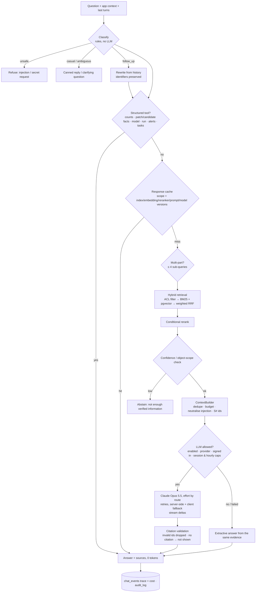
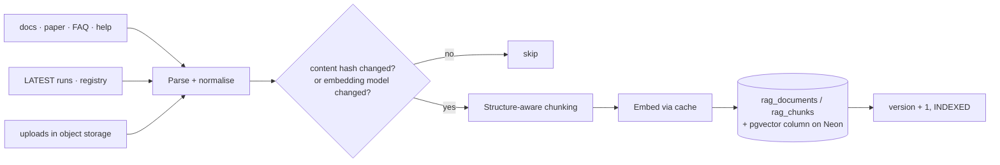

# EcoConnectAI Assistant — RAG architecture

Status: implemented, tested and evaluated (2026-10-01). Companion docs: [SETUP](SETUP.md) · [INGESTION](INGESTION.md) ·
[RETRIEVAL](RETRIEVAL.md) · [EVALUATION](EVALUATION.md) · [SECURITY](SECURITY.md) · [COST](COST.md) · [TROUBLESHOOTING](TROUBLESHOOTING.md).

This is retrieval-augmented generation, **not model training**: no model is trained or fine-tuned on project data.
Knowledge stays in the database and is retrieved per question; the LLM only writes answers from what is retrieved.

## 1. The existing system (what the assistant sits on)

| Concern | Existing component |
|---|---|
| Frontend | Next.js 16 / React 19, `frontend/components/chat/eco-assistant.tsx` (floating chat panel) |
| Backend | FastAPI (`backend/main.py`, routers), Python 3.11 in Docker (3.14 on the dev Mac) |
| Database | SQLAlchemy + Alembic; SQLite (dev/tests), PostgreSQL (local PG18 cluster, **Neon** in production) |
| Auth | JWT access + rotating refresh tokens; 6 roles; capabilities checked server-side (`backend/auth.py`) |
| Jobs | DB-backed queue + inline worker (`backend/jobs.py`) — used for ingestion |
| Storage | `backend/storage.py` local / S3-compatible — used for uploaded documents |
| Logging | JSON logs with request ids, route metrics (`backend/observability.py`), audit log table |
| Data | stored analysis runs (`outputs/runs/<area>/<run>`), model registry, field tasks/evidence, reports, alerts |
| Previous assistant | tiered: structured lookups → answer cache → in-memory BM25 + trigram index → Claude with JSON-schema citations (one LLM call site, `assistant_llm.ask_llm`) |

LLM call sites today: `backend/rag/generation.py` (the assistant) and `backend/assistant_llm.ask_llm` (legacy
`/api/assistant/ask` endpoint only). No other code calls an LLM.

## 2. What is searchable and what is not

| Data | Indexed for retrieval? | How it is answered |
|---|---|---|
| README, `docs/*.md`, `docs/rag/*.md`, `docs/ASSISTANT_FAQ.md` | yes (public) | RAG |
| Research paper (`docs/paper_source_main.tex`) | yes (public) | RAG |
| Page help + glossary (frontend wording) | yes (public) | RAG |
| Study-area configuration, model registry | yes (public) | RAG + structured tools |
| Each area's LATEST run: summary, network, every patch, every candidate, stored what-if | yes (public, scoped to its study area) | structured tools first, RAG for "why" |
| Admin-uploaded documents (md/txt/html/json/csv/pdf) | yes, visibility chosen at upload (public / staff / admin) | RAG |
| Field tasks, evidence, photos, users, audit log, reports, refresh tokens, chat logs | **never indexed, never sent to the LLM** | permission-checked structured tools return counts/statuses only |
| Raw rasters, checkpoints | not indexed | — |

Rationale: structured questions ("how many patches", "P07's area") must come from the authoritative store, not from
an embedding; private operational data is answered by code that checks the caller's role, so no retrieval mistake can
leak it.

## 3. Request flow

Offline, separately from the request path:

## 4. Decisions and reasons

| Decision | Choice | Why (alternatives considered) |
|---|---|---|
| Generation | Claude Opus 5.5 for every LLM route (effort low for chat-style questions, medium for analytical / multi-step), Claude Sonnet 5.5 as the app-level fallback, server-side refusal fallback (`fallbacks: "default"`), streaming, prompt caching of the system prompt; `ANTHROPIC_WORKSPACE_ID` header for keys not scoped to a workspace | Highest answer quality; low effort keeps chat answers ~2–3 US cents. Structured questions (counts, rankings, what-if) never call the LLM. |
| Vector store | **pgvector on PostgreSQL** (`rag_chunks.embedding_vec vector(384)`, HNSW cosine index; migrations 0007 + 0008 backfill) — used locally (PG18 + pgvector 0.8.7) and on Neon; semantic search runs in SQL with the ACL and study-area filters. In-process numpy over the same stored vectors only where the extension is missing (SQLite in tests) | The project already runs PostgreSQL — no new infrastructure, one database for data, documents and vectors. Ingest backfills the vector column from stored embeddings, so enabling pgvector later needs no re-embedding. |
| Embeddings | **Local ONNX `BAAI/bge-small-en-v1.5`** via fastembed (384-dim), baked into the Docker image | No API key, no per-query cost, private text never leaves the server, ~2 ms per query on CPU. Anthropic has no embedding API; Voyage AI would add a second vendor and send documents out. Deterministic hashing embedder for tests/CI (declared as non-semantic). |
| Lexical | BM25 over the same chunks, query-side synonym expansion | Exact identifiers (P07, C05, IIC, Sentinel-1) and phrases; dense search alone misses them. |
| Fusion | Reciprocal-rank fusion (k = 60) + small structural priors | Robust to incomparable score scales; no tuning of weights between BM25 and cosine. |
| Reranking | Local heuristic feature scorer by default; cross-encoder (`ms-marco-MiniLM-L-6-v2`) optional; **skipped when retrieval is decisive** | Measured on the 89-question golden set (2026-10-02): heuristic recall@5 1.0, MRR 0.976, citation correctness 1.0, p95 12 ms; cross-encoder recall@5 1.0, MRR 0.976, citation correctness 0.986, p95 1.1 s — no gain for 100× latency. |
| Query understanding | Rules (classification, follow-up rewriting, memory summary) | Zero extra LLM calls; deterministic and testable. |
| Generation | Plain-text answer with inline `[S#]` citations; routed model; streaming | Works on every current Claude model (Haiku 4.5 does not support the adaptive-thinking / effort options); citations are validated in code. |
| Model routing | fast (Haiku 4.5) for knowledge/follow-ups, strong (Sonnet 5.5) for analytical/multi-step, configurable | Cheapest model that is adequate for short grounded answers. |
| Fallback | retries with exponential backoff + jitter (retryable errors only) → a different fallback model → extractive answer | The assistant never fails a question because the LLM is down, and never falls back to ungrounded text. |
| Fine-tuning | **not used** | No requirement that RAG + prompt cannot meet (facts change with every run; fine-tuning would freeze them). Revisit only for a style/format requirement. |

## 5. Security model (summary — see [SECURITY](SECURITY.md))

Authorization is applied **before** scoring: chunks carry `visibility` (public/staff/admin) and run chunks are scoped
to the study area; the retriever never scores a chunk the caller may not see. Retrieved text is untrusted: instruction-
like lines are neutralised and every item is fenced in `<source>` tags; the system prompt treats it as data.
Prompt-injection and secret-extraction questions are refused before retrieval. The LLM cannot run SQL or tools; all
database access goes through predefined, parameterised functions.

## 6. Caching model

| Layer | Key | Invalidation |
|---|---|---|
| Embedding cache (`rag_embedding_cache`) | content sha256 + embedding model version | never stale (content-addressed) |
| Query-embedding cache (LRU 512) | model version + normalised query | process lifetime |
| Retrieval cache (LRU 256) | index version + role scope + area + selected object + query tokens | index version changes |
| Response cache (`chat_cache`) | area, run, objects, role scope, **index version, embedding model, reranker version, prompt version, model** + normalised question (exact or Jaccard ≥ 0.75) | any version changes; TTL `RAG_CACHE_TTL` |
| Prompt cache (provider) | static system prompt marked `cache_control: ephemeral` | provider-managed (only above the model's minimum prompt length) |

## 7. Cost-control model

Structured tools and retrieval answer most questions with **0 LLM tokens**. The LLM is used only for signed-in users,
only when enabled and configured, under per-session (`MAX_LLM_CALLS_PER_SESSION`) and per-user hourly caps, with a
bounded context (`RAG_MAX_CONTEXT_TOKENS`) and output (`MAX_OUTPUT_TOKENS`). Every request records model, tokens
(actual usage from the provider) and cost. See [COST](COST.md).

## 8. Fallback model

LLM unavailable / timeout / rate-limited → retries → server-side fallback (`claude-sonnet-5-5`) → client fallback model →
extractive answer with a visible note. A model refusal is treated as no answer. BM25 error → vectors only.
Embedding model unavailable → lexical retrieval (reported in diagnostics). pgvector query error → in-process vectors →
lexical. Reranker error → heuristic. Index empty (first boot before the ingest job finishes) → sources are chunked in
memory and searched lexically. Low confidence → abstention, never a guess.

## 9. Evaluation strategy

Golden set of 105 questions (`tests/rag/golden.jsonl`, with expected route), retrieval ablation (BM25 / vector / hybrid),
nDCG@5, route accuracy and an optional LLM judge (`--llm live --judge N`), run by `scripts/rag_eval.py` with the real
embedding model; a pytest gate re-runs it with the hashing embedder and with a stub LLM on every test run. Failure-mode
tests in `tests/rag/test_pipeline.py` and `tests/test_chat.py`. Results: [EVALUATION](EVALUATION.md). Routing: [QUERY_ROUTING](QUERY_ROUTING.md); caching: [CACHING](CACHING.md);
deployment and re-indexing: [DEPLOYMENT](DEPLOYMENT.md).

## 10. Service boundaries (code)

`backend/rag/`: `config` · `sources` (parsers + loaders) · `chunking` · `embeddings` · `ingest` · `retrieval` ·
`rerank` · `context` · `classify` · `generation` · `cost` · `service`. `backend/chat.py` = structured tools, cache,
tracing; `backend/chat_api.py` = HTTP (`/api/chat`, `/api/chat/stream`, `/api/rag/*`).
